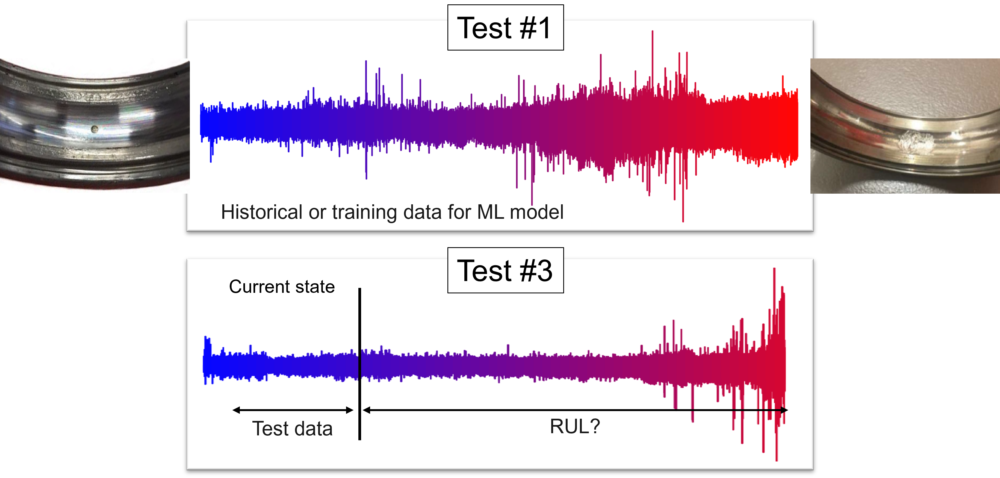

# Bearing Remaining Useful Life Prediction

This repository contains a deep learning project for predicting the Remaining Useful Life (RUL) of rolling element bearings using time series models. The project implements and compares three deep learning architectures:
- Recurrent Neural Networks (RNN)
- Long Short-Term Memory Networks (LSTM)
- WaveNet

## Project Overview

- Time series modeling of bearing degradation using RMS health indicators
- Implementation of RNN, LSTM, WaveNet architectures for comparison
- Performance evaluation using MSE metric
- Visualization of predictions against normalized RUL values

## Technical Approach

The project treats the RUL prediction problem as a sequence-to-value regression task. The workflow:
1. Load vibration signals from Hugging Face dataset
2. Process signals into frames and calculate RMS values
3. Apply moving average smoothing to RMS values
4. Create sequences for time series modeling
5. Train models to predict normalized RUL (1.0 -> 0.0)


## Data



The project uses the "alidi/bearing-run2failure-unsw" dataset from Hugging Face, which is a subset of the UNSW bearing run-to-failure dataset ([https://data.mendeley.com/datasets/h4df4mgrfb/3](https://data.mendeley.com/datasets/h4df4mgrfb/3)).

> **Note:** To access the dataset, you'll need a Hugging Face account and access token:
> ```python
> from huggingface_hub import login
> login(token="your_huggingface_token")
> ```
> To get your token: Sign up at huggingface.co → Settings → Access Tokens → Create new token

### Dataset Characteristics
- Horizontal acceleration (accH) measurements
- Test 1 and Test 3 from the original dataset
- Sampling frequency: 51200 Hz
- Operating conditions:
  - Speed: 6.0 Hz
  - Radial load: 10.5 kN
- Fault characteristics:
  - Defect sizes: 1.0 mm (Test 1) and 0.5 mm (Test 3)
  - Defect type: Ball Pass Frequency Outer race (BPFO)

The image above illustrates the bearing degradation process captured in both test datasets. Test #1 provides complete run-to-failure data for training, while Test #3 demonstrates the prediction scenario where RUL needs to be estimated from a current state.

### Data Structure
Each sample in the dataset contains:
- Signal data (raw acceleration measurements)
- Signal length
- Sampling frequency
- Operating parameters (speed, load)
- Fault information (defect size, type)

## Data Processing Pipeline

1. Signal Processing:
   - Split raw signals into frames using librosa
   - Calculate RMS for each frame
   - Apply moving average smoothing

2. RUL Calculation:
   - Use linear degradation pattern
   - Normalize to range [1.0, 0.0]
   - 1.0 represents healthy state
   - 0.0 represents failure state

3. Sequence Creation:
   - Create overlapping sequences for time series modeling
   - Split into train/validation/test sets
   - Maintain temporal order of sequences


## Getting Started

### Prerequisites
- Python 3.7+
- TensorFlow 2.x
- Hugging Face datasets
- NumPy
- Matplotlib
- Librosa
- Scikit-learn

### Installation

1. Clone this repository:
   ```bash
   git clone https://github.com/your-username/bearing-rul-prediction.git
   cd bearing-rul-prediction
   ```

2. Create and activate Poetry environment:
   ```bash
   poetry install
   ```

### Usage

To train an LSTM model:
```bash
python main.py --model lstm --seq_length 100 --epochs 200
```


Additional arguments:
- `--batch_size`: Batch size for training (default: 64)
- `--patience`: Patience for early stopping (default: 40)
- `--frame_length`: Frame length for initial signal framing (default: 42000)
- `--hop_length`: Hop length for initial signal framing (default: 21000)
- `--filter_windows_size`: Window size for moving average filter (default: 11)


## Repository Structure

```
bearing-rul-prediction/
├── models/                 # Model definitions
│   ├── __init__.py
│   ├── lstm_model.py      # LSTM model implementation
│   └── rnn_model.py       # RNN model implementation
│   └── wavenet_model.py   # WaveNet model implementation  
├── utils/                 # Utility functions
│   ├── __init__.py
│   ├── data_processing.py # Data loading and preprocessing
│   └── visualization.py   # Plotting and visualization
├── results/               # Results and figures
│   └── .gitkeep
├── README.md              # This file
├── LICENSE               # License file
└── main.py               # Main script to run the pipeline
```

## Results

The trained models produce several output files in the `results/` directory:
- Training history plots
- Validation results plots
- Test results plots

Plots show:
- Training and validation loss over epochs
- Actual vs predicted normalized RUL values
- Performance comparison between validated models

## License

This project is licensed under the MIT License - see the LICENSE file for details.
